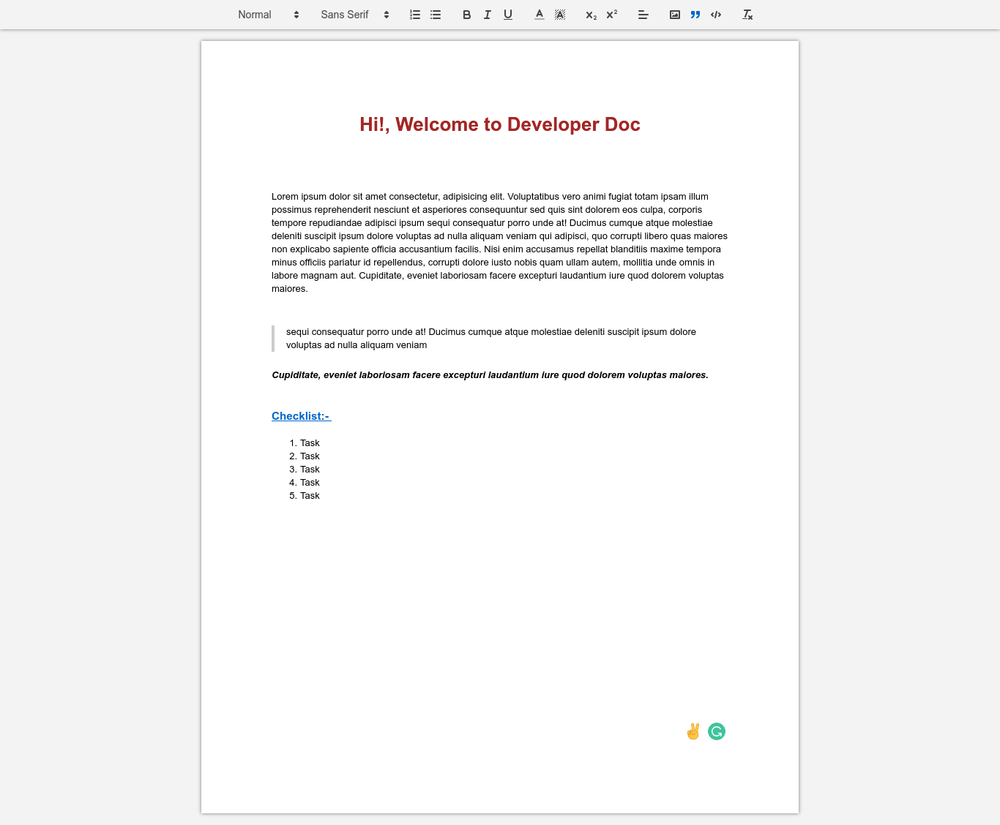

# Developer-Doc

*This web application allows you to create, maintain and edit doc in realtime and plan your schedule and strategies.*

---

## Image

---

## Tech Stack implemented

* HTML, CSS, and JS
* Node JS
* React JS
* Socket .io
* Mongo DB

---

## Setting up Developmnent Server

* Fork and Clone the Repository

`git clone https://github.com/abhishek2x/Developer-Doc.git`

* Change Directory
  * `cd Developer-Doc`

* Now we have two folders
  * server - backend
  * client - frontend

* Install dependencies
  * `npm i` or `yarn`

* For frontend
  * `cd client` && `npm start`
* For backend
  * `cd server` && `npm run dev`

---